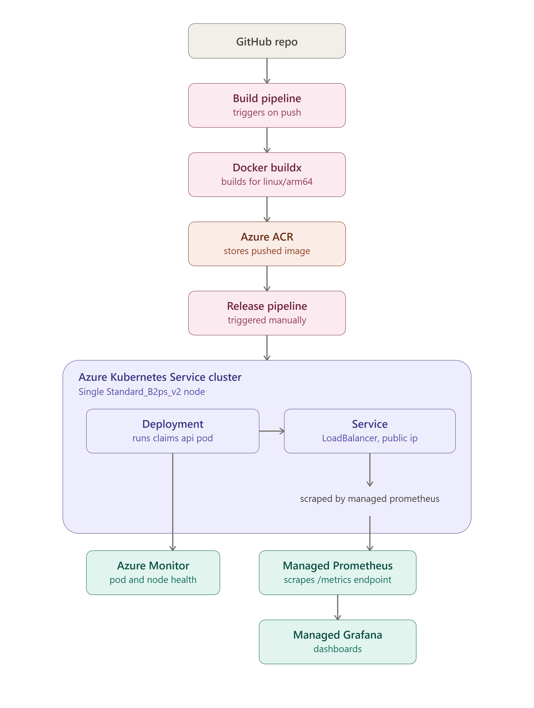
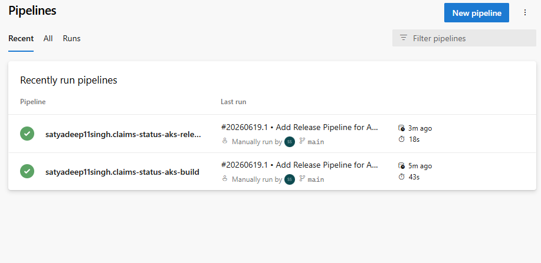
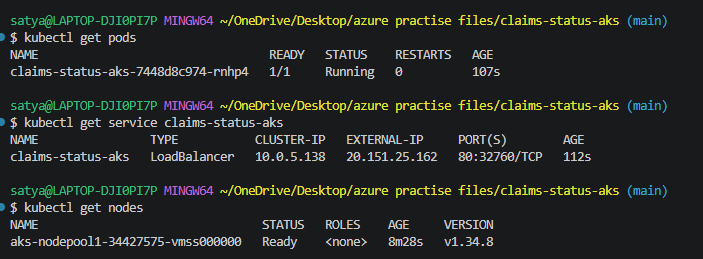
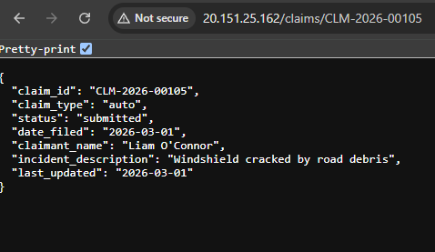
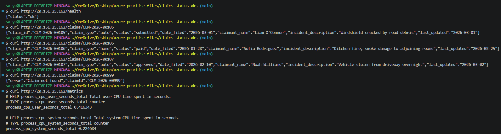
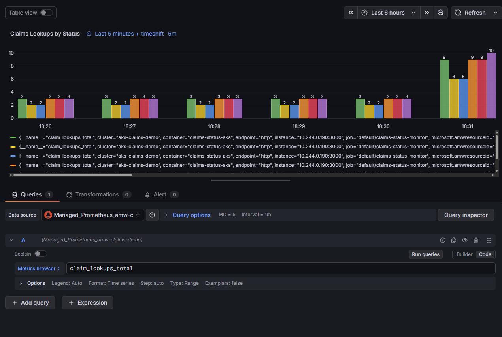
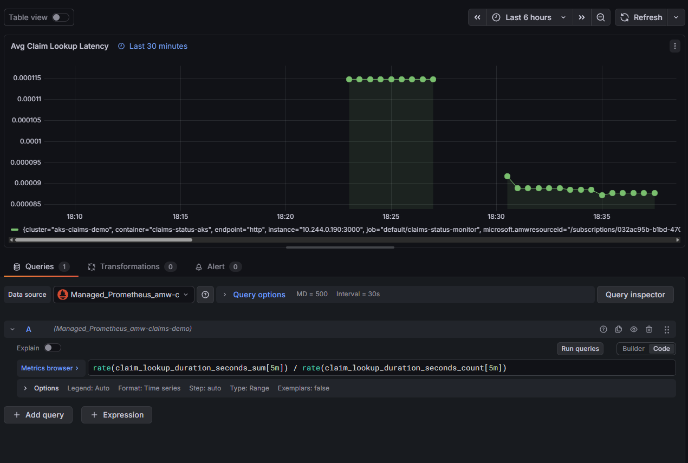
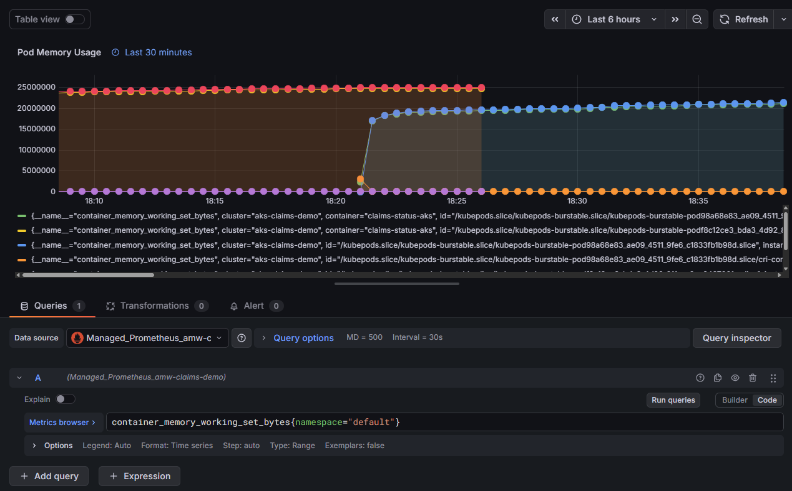

# Northwind Mutual — Claims Status Lookup Service

A containerized claims-status lookup API, deployed to Azure Kubernetes Service (AKS),
with observability via Azure Monitor, Azure Managed Prometheus, and Azure Managed Grafana.

This is a personal practice project built to learn Azure and Kubernetes fundamentals,
inspired by my work in the insurance industry. **"Northwind Mutual" is a fictional
company, and all claimant names, claim records, and incident descriptions in this
project are synthetic. This project does not represent or use any real systems,
data, or processes from any actual insurer.**

---

## What this project does

The service exposes a small REST API for looking up the status of an insurance claim
by claim ID — the kind of internal tool a claims-processing team might use to check
where a claim stands (submitted, under review, approved, paid, or denied).

```
GET /claims/CLM-2026-00105
```
```json
{
  "claim_id": "CLM-2026-00105",
  "claim_type": "auto",
  "status": "submitted",
  "date_filed": "2026-03-01",
  "claimant_name": "Liam O'Connor",
  "incident_description": "Windshield cracked by road debris",
  "last_updated": "2026-03-01"
}
```

The app also exposes Prometheus-formatted metrics (`/metrics`) tracking lookup
volume by status, and lookup latency — giving the deployment something real to
monitor in Grafana beyond generic infrastructure stats.

---

## Architecture



**Flow:** Code pushed to GitHub → **Azure DevOps Build Pipeline** builds the Docker
image and pushes it to Azure Container Registry → **Azure DevOps Release Pipeline**
applies the Kubernetes manifests to deploy it to AKS → exposed via a LoadBalancer
Service → scraped by Azure Managed Prometheus → visualized in Azure Managed Grafana,
with Azure Monitor (Container Insights) providing cluster-level health visibility.

| Layer | Technology |
|---|---|
| Application | Node.js, Express |
| Database | SQLite (`node:sqlite`, bundled in-container) |
| Metrics | `prom-client`, custom counters + histogram |
| Containerization | Docker (multi-arch build, ARM64 for AKS node) |
| CI/CD | Azure DevOps Pipelines (separate Build and Release pipelines) |
| Registry | Azure Container Registry (Basic SKU) |
| Orchestration | Azure Kubernetes Service (1-node, Standard_B2ps_v2) |
| Monitoring | Azure Monitor, Azure Managed Prometheus, Azure Managed Grafana |

### CI/CD pipelines

This project uses two separate Azure DevOps pipelines, matching the two distinct
concerns of build and deploy:

- **Build Pipeline** ([`azure-pipelines-build.yml`](./azure-pipelines-build.yml)) —
  triggers on push to `main` (when files under `app/` change), builds the Docker
  image using Buildx for `linux/arm64` (to match the AKS node architecture), and
  pushes it to Azure Container Registry.
- **Release Pipeline** ([`azure-pipelines-release.yml`](./azure-pipelines-release.yml)) —
  triggered manually rather than automatically. It applies `k8s/deployment.yaml`
  and `k8s/service.yaml` to the AKS cluster and confirms the resulting service's
  external IP. It's manual by design: since the AKS cluster is torn down between
  practice sessions, an auto-triggered deploy would simply fail whenever the
  cluster doesn't currently exist.

---

## Why this exists

I work in the insurance industry (auto and home) and wanted a portfolio project that
reflects that domain rather than a generic "hello world" container. The goal wasn't
to build something complex — it's deliberately scoped to a single, realistic use case
(claim status lookup) so the focus stays on the cloud infrastructure: containerizing
an app, deploying it to Kubernetes, wiring up a registry, and setting up real
observability — the core skills the underlying exercise was designed to teach.

---

## Screenshots

**CI/CD pipelines (Azure DevOps):**




**Live deployment on AKS:**





**Monitoring dashboards (Azure Managed Grafana):**




*(Note: this project is torn down between practice sessions to control cloud costs —
see "Running this yourself" below for why there's no permanent live link.)*

---

## Running this yourself

Full provisioning commands are documented in [`docs/provisioning-notes.md`](./docs/provisioning-notes.md).

**Infrastructure setup** (resource group, ACR, AKS) is done manually via Azure CLI,
since this is the foundational infrastructure the pipelines deploy onto:

```bash
az group create --name <rg> --location <region>
az acr create --resource-group <rg> --name <acr-name> --sku Basic
az aks create --resource-group <rg> --name <cluster> --node-count 1 \
  --node-vm-size Standard_B2ps_v2 --attach-acr <acr-name> --generate-ssh-keys
```

**Build and deploy** are then handled by the two Azure DevOps pipelines:

1. Push a change under `app/` to `main` → the **Build Pipeline** automatically
   builds the image and pushes it to ACR.
2. Run the **Release Pipeline** manually → it applies the manifests in `k8s/`
   to the AKS cluster.

**Monitoring** (Azure Monitor workspace + Managed Grafana) is wired up manually,
since it only needs to be set up once per practice session and isn't part of the
build/deploy loop:

```bash
az aks update --resource-group <rg> --name <cluster> --enable-azure-monitor-metrics \
  --azure-monitor-workspace-resource-id <id> --grafana-resource-id <id>
```

## Local development

```bash
cd app
npm install
node db/seed.js     # creates and seeds the SQLite database
node server.js       # starts the API on localhost:3000
```

---

## Cost-conscious design

This project was built and run on an Azure free-trial account with a fixed credit
budget, so cost control was treated as a real design constraint, not an afterthought:

- All work that doesn't require live Azure resources (the app itself, metrics
  instrumentation, Dockerfile, Kubernetes manifests) was built and verified locally
  first, entirely free, before any cloud resource was created.
- Azure resources are provisioned in a single dedicated resource group and **torn
  down completely after every working session** — this is why there's no permanent
  live URL for this project. Screenshots and `kubectl`/`curl` output captured while
  the deployment was live serve as the record of it working.
- The most expensive component (Azure Managed Grafana) was only provisioned for the
  monitoring stage, used long enough to confirm dashboards worked and capture
  screenshots, then deleted.
- A budget alert and a manual before/after-session cost check were used throughout
  to catch unexpected spend early.

---

## What I'd improve with more time

- Swap SQLite for a real managed database (Azure SQL or Cosmos DB) to practice
  cross-service networking and connection security
- Add ingress with TLS instead of exposing the service directly via a LoadBalancer IP
- Add a claim status *history* (audit trail of status changes over time) rather than
  just the current status
- Multi-node cluster with pod autoscaling, to practice load-based scaling behavior
- Infrastructure as Code (Terraform) instead of manual `az` CLI commands for the
  base infrastructure setup — planned for a later project in this series
- Add automated tests to the Build Pipeline before the image build step

---

## Disclaimer

This is a personal learning project. "Northwind Mutual," all claim records, and all
claimant names are entirely fictional and were generated for demonstration purposes.
This project is not affiliated with, and does not represent the systems, data, or
practices of, any real insurance company.